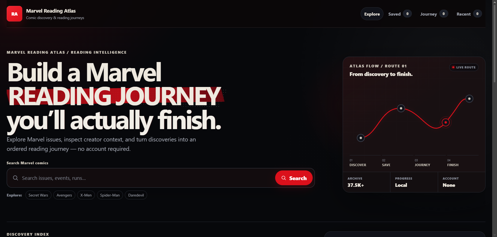

# Marvel Reading Atlas

[](https://github.com/MykolaDotsenko/marvel-reading-atlas/actions/workflows/quality.yml)

**Find an issue. Build a reading order. Keep your place.**

[**Open the live app →**](https://marvel-starter-phi.vercel.app/) · [Architecture](./ARCHITECTURE.md)

<a href="https://marvel-starter-phi.vercel.app/">
  
</a>

Marvel Reading Atlas turns a large external comics catalogue into a simple reading workflow:

```text
discover → inspect → save → order → read → continue
```

No account is required.

## Why this repository changed direction

The project originally used Marvel's Developer API for a small character-search exercise. That source later became unavailable.

Rather than leave the app wrapped around a dead dependency, I changed the product:

1. isolate the provider boundary;
2. move to the community-maintained Marvel Metadata API;
3. normalize provider data into an application-owned issue model;
4. redesign the UI around comic discovery and reading progress.

That provider failure became a product/architecture decision, not just an endpoint replacement.

## What the app does

- search 37,500+ indexed issues;
- browse recent issues with bounded pagination;
- open shareable issue details through URL state;
- inspect series, dates, page counts and creator credits;
- save issues and keep recent history;
- build an ordered reading list of up to 200 issues;
- reorder without requiring drag-and-drop;
- mark issues read/unread and continue from the next unread issue;
- keep Saved, Recent and Reading useful if the provider is temporarily unavailable.

## Provider boundary

External payloads do not become UI or persisted state directly.

```text
Marvel Metadata API
        ↓
fetch / timeout / cancellation
        ↓
validation + normalization
        ↓
application issue model
        ↓
React UI + local reading snapshots
```

The reading library stores compact issue snapshots rather than raw provider responses. Saved material can therefore render without an N+1 round trip back to the provider.

Malformed list entries fail closed instead of breaking the full result set.

## URL state

Search query, selected issue and active view live in the URL:

```text
/?q=Secret+Wars&issue=52447&view=reading
```

That gives useful Back/Forward behaviour and shareable issue views without adding a routing library solely for this scope.

## Network behaviour

- obsolete list/detail requests are aborted;
- provider calls have a bounded timeout;
- successful responses use a small in-memory cache;
- already-loaded results survive pagination failure;
- one-character searches are stopped before reaching the provider;
- a scheduled live-contract smoke test detects upstream drift separately from normal deterministic CI.

## Architecture

```text
React UI
  ├── feature hooks
  │     ├── provider adapter
  │     │      └── issue normalization
  │     ├── URL/history state
  │     └── reading-library storage
  └── semantic HTML + CSS
```

Local storage contains deliberate user state and compact issue snapshots. Loading/error/provider response state stays in memory.

Corrupt stored data falls back safely instead of blocking the application.

## Stack

- React 19
- Vite 8
- JavaScript
- Fetch + AbortController
- History / URLSearchParams
- Web Storage
- Vitest
- Playwright
- axe-core
- ESLint
- Vercel

React and React DOM are the only runtime packages used by the application.

## Accessibility and quality

The product includes semantic controls, keyboard focus, reduced-motion/forced-colors support, non-drag list movement and mobile layouts without horizontal overflow.

```bash
npm ci
npm run check
npm run test:e2e
```

CI covers linting, unit/API/storage tests, production build, dependency audit, Chromium/Firefox/WebKit, a Pixel-sized viewport and axe checks.

The external provider is smoke-tested separately so a third-party outage does not make normal pull requests flaky.

## Run locally

Requires Node.js 24+.

```bash
npm ci
npm run dev
```

No API key is required.

## Deployment

Canonical public demo:

**https://marvel-starter-phi.vercel.app/**

## Data and trademark note

Marvel Reading Atlas is an unofficial portfolio project and is not affiliated with Marvel Entertainment.

Metadata comes from the community-maintained Marvel Metadata API. No comic pages or paid comic content are distributed by this repository.
